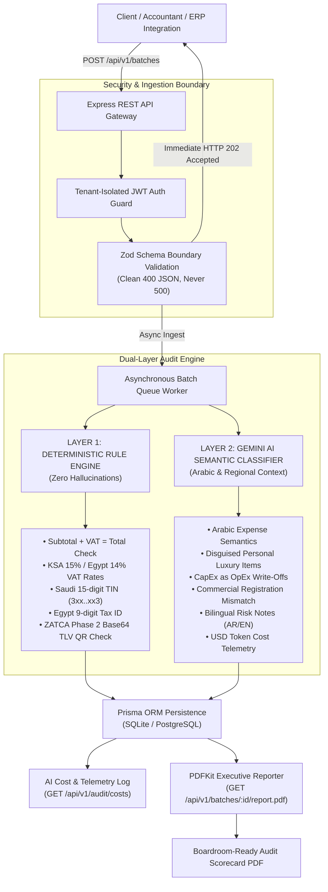

# TaxShield MENA 🛡️
### AI-Powered Pre-Filing Tax Compliance & Supplier Invoice Risk Auditor

<div align="center">

[](https://github.com/3mr-5aled/flyrank-capstone-taxshield-mena)
[](https://internship.flyrank.ai/verify?id=FR-D11-0A358-5D8C2)
[](https://internship.flyrank.ai/verify?id=FR-D8-313B4-69F3D)
[](https://github.com/3mr-5aled/flyrank-capstone-taxshield-mena)
[](https://www.typescriptlang.org/)
[](https://nodejs.org/)

**Author:** [Amr Khaled Morcy](https://github.com/3mr-5aled) — *Back-End AI Engineering Intern*  
**Program:** [FlyRank AI Internship](https://github.com/3mr-5aled/flyrank-ai-internship) (July 1 – September 16, 2026)  
**Supervisor of Record:** Arijana Ibrović (Director of Internship Program) • **Program Approval:** Alen Malkoc (Founder & CEO, FlyRank Corp.)  
**Official Verifications:** [Certificate of Completion](https://internship.flyrank.ai/verify?id=FR-D11-0A358-5D8C2) • [Final Evaluation Report](https://internship.flyrank.ai/verify?id=FR-D8-313B4-69F3D) • [Recommendation Letter](https://internship.flyrank.ai/verify?id=FR-D10-4B9AF-BA6BE) • [Main Assignment Repo](https://github.com/3mr-5aled/flyrank-ai-internship)

</div>

---

## 1. The 10x Solution Pitch

### The Real-World Friction
In the Middle East, corporate finance and accounting teams operate under strict e-invoicing mandates: **Saudi Arabia ZATCA Phase 2** and **Egyptian Tax Authority (ETA)**. Under these regimes, filing an erroneous or non-compliant supplier invoice—or claiming ineligible input Value Added Tax (VAT)—triggers punitive government audits, non-deductibility of expenses, and crippling tax penalties.

Prior to quarterly tax filings, corporate accountants manually inspect hundreds of incoming supplier invoices across PDFs, spreadsheets, and vendor portals to:
1. Validate supplier Tax Identification Numbers (TINs) against national checksum rules.
2. Cross-verify line-item arithmetic and mandatory tax rates (15% in KSA, 14% in Egypt).
3. Detect fraudulent or ineligible deductions: dishonest vendors or employees disguising **personal luxury goods** (e.g. personal Rolex watches or jewelry) as "office supplies", or misclassifying capital expenditures (CapEx like vehicles or servers) as immediate operational expenses (OpEx).

Manually auditing a routine monthly batch of **200 supplier invoices takes an enterprise accounting team 2 full business days (16 hours)** of tedious, error-prone manual labor.

### The 10x Claim
> **"Manually auditing 200 supplier invoices takes an accounting team 2 full days; TaxShield MENA audits the entire batch, catches tax fraud & arithmetic anomalies with dual-layer AI, and exports an executive tax audit PDF in under 60 seconds."**

### Explicit Non-Goals (Scope Guard)
* **No Live Government Submission:** TaxShield MENA is strictly a **pre-filing audit firewall & risk detection engine**. It does not transmit live invoices to ZATCA or ETA clearance servers.
* **No Full ERP / General Ledger:** It does not do payroll, bank reconciliation, or double-entry bookkeeping.
* **No Payment Processing:** No credit card transactions or banking APIs.

---

## 2. System Architecture & Dual-Layer Audit Model

Financial systems cannot afford LLM hallucinations when calculating statutory tax obligations. TaxShield MENA implements a strict **dual-layer architecture**:
* **Layer 1 (Deterministic Code Engine)**: 100% mathematical certainty, exact decimal precision, national tax ID verification, and ZATCA Phase 2 QR Base64 TLV format validation.
* **Layer 2 (Gemini AI Semantic Engine)**: Arabic natural language understanding to flag disguised personal expenses, commercial activity mismatches, and illegal OpEx write-offs, complete with token counting and real-time USD cost logging.



---

## 3. Program Concepts Implemented (6 Concepts + Swap)

TaxShield MENA fulfills and exceeds the requirements of the FlyRank Backend track:

| # | Program Concept | Implementation in TaxShield MENA | Source File(s) |
|---|---|---|---|
| **1** | **API Endpoints & Validation** | Full RESTful HTTP API with Zod validation boundaries. Invalid input strictly returns clean 400 JSON errors with field-level breakdowns, never unhandled 500s. Interactive OpenAPI/Swagger UI at `/docs`. | [`src/modules/invoices/invoice.schema.ts`](./src/modules/invoices/invoice.schema.ts), [`src/routes/api.router.ts`](./src/routes/api.router.ts) |
| **2** | **Database & Persistence** | Relational data model managed through Prisma ORM (`dev.db` / PostgreSQL). Tables for `tenants`, `users`, `batches`, `invoices`, `line_items`, `audit_findings`, and `ai_cost_logs`. All state survives server restarts. | [`prisma/schema.prisma`](./prisma/schema.prisma), [`src/db/prisma.ts`](./src/db/prisma.ts) |
| **3** | **Authentication & Security** | Multi-tenant user registration and login with bcrypt password hashing (10 salt rounds), signed JSON Web Tokens (JWT), and `requireAuth` / `optionalAuth` middleware protecting private routes with HTTP 401. | [`src/modules/auth/auth.service.ts`](./src/modules/auth/auth.service.ts), [`src/modules/auth/auth.middleware.ts`](./src/modules/auth/auth.middleware.ts) |
| **4** | **Background Jobs & Queues** | Asynchronous batch auditor (`POST /api/v1/batches`) executing batch audits off the HTTP request thread with real-time percentage progress tracking (`0%` $\rightarrow$ `100%`) and immediate HTTP 202 responses. | [`src/modules/batches/batch.service.ts`](./src/modules/batches/batch.service.ts), [`src/modules/batches/batch.controller.ts`](./src/modules/batches/batch.controller.ts) |
| **5** | **Reporting (Executive PDF)** | Boardroom-ready PDF generator using `pdfkit`. Compiles executive KPI cards (Compliance Rate %, At-Risk Input VAT), financial spend rollups, and itemized discrepancy tables with severity badges. | [`src/modules/reports/pdf-report.generator.ts`](./src/modules/reports/pdf-report.generator.ts) |
| **7** | **LLM Integration & Cost Log** | Google Gemini Flash integration analyzing Arabic and English invoice descriptions for fraud and improper CapEx deductions, with per-call prompt/completion token counting and USD cost tracking stored in `ai_cost_logs`. | [`src/modules/ai/gemini-tax.classifier.ts`](./src/modules/ai/gemini-tax.classifier.ts) |
| *Swap* | **Test Suite** *(in place of Caching)* | Caching was swapped for a comprehensive automated test suite (13 unit/integration tests + 19 end-to-end route tests) because tax auditing mandates fresh, deterministic evaluation on every batch without stale cached results. | [`src/test-all.ts`](./src/test-all.ts), [`src/test-all-routes.ts`](./src/test-all-routes.ts) |

---

## 4. API Endpoints Reference

Base URL: `http://localhost:3000`

| Method | Endpoint | Auth | Purpose |
|---|---|---|---|
| `GET` | `/health` | Public | Service health check and uptime probe |
| `GET` | `/docs` | Public | Interactive Swagger / OpenAPI documentation UI |
| `POST` | `/api/v1/auth/register` | Public | Register new tenant and admin user |
| `POST` | `/api/v1/auth/login` | Public | Authenticate user and receive JWT Bearer token |
| `GET` | `/api/v1/auth/me` | Bearer Token | Retrieve currently authenticated user profile |
| `POST` | `/api/v1/invoices/audit-single` | Optional | Synchronous single-invoice audit with dual-layer analysis |
| `GET` | `/api/v1/invoices` | Public | Paginated list of audited invoices with filters |
| `GET` | `/api/v1/invoices/:id` | Public | Retrieve detailed invoice record with findings |
| `POST` | `/api/v1/batches` | Optional | Submit batch of 1–200 invoices for async background audit |
| `GET` | `/api/v1/batches/:id` | Public | Poll batch processing status, progress %, and metrics |
| `GET` | `/api/v1/batches/:id/report.pdf` | Public | Download boardroom-ready Executive Tax Audit PDF |
| `GET` | `/api/v1/audit/costs` | Public | Financial telemetry: total AI calls, tokens, and USD spent |

---

## 5. Quick Start (Clean Machine in 1 Minute)

### Prerequisites
* **Node.js**: v18+ (tested on Node.js v20 & v26)
* **npm**: v9+
* *Optional*: Docker & Docker Compose

### Option A: Local Node.js Execution

```bash
# 1. Clone the repository
git clone https://github.com/3mr-5aled/flyrank-capstone-taxshield-mena.git
cd flyrank-capstone-taxshield-mena

# 2. Install dependencies
npm install

# 3. Initialize the database schema
npm run db:push

# 4. Seed demo data (sample tenants, users, batches, and pre-audited invoices)
npm run seed

# 5. Run the automated test suite (13 unit/integration tests)
npm test

# 6. Start the development server
npm run dev
```

The server starts immediately at **`http://localhost:3000`**.

### Option B: Docker Containerized Execution (Zero Node.js Setup)

```bash
docker compose up --build
```

---

## 6. The 5-Minute Evaluator Demo Walkthrough ("Open X, Click Y, See Z")

Follow these steps to demonstrate the end-to-end 10x value in under 5 minutes:

### Pre-Seeded Test Credentials
* **Saudi Tenant Accountant:** `accountant@riyadhtech.sa` / `Password123!`
* **Egyptian Tenant Auditor:** `auditor@cairodigital.eg` / `Password123!`

---

### Step 1: Open Swagger UI
1. Navigate to **`http://localhost:3000/docs`** in your browser.
2. Notice all endpoints are fully documented with pre-filled sample JSON payloads.

### Step 2: Queue a Mixed Batch of 3 Invoices
1. Expand **`POST /api/v1/batches`** and click **"Try it out"**.
2. The default JSON payload includes 3 real-world test cases:
   - **Invoice 1 (Compliant KSA)**: A 100% compliant IT consulting invoice with 15% VAT and valid Saudi TIN.
   - **Invoice 2 (AI Semantic Fraud)**: An invoice disguising a **luxury Rolex Gold Watch** (`ساعة يد رولكس ذهبية فاخرة`) under general office supplies.
   - **Invoice 3 (Rule Engine Math Mismatch)**: An Egyptian invoice where stated VAT is 1,000 EGP instead of the required 14% (2,800 EGP).
3. Click **"Execute"**.
4. **See:** Immediate `HTTP 202 Accepted` response with `status: "QUEUED"` and your unique `batchId`.

### Step 3: Inspect Live Batch Audit Results
1. Copy the `batchId` returned in Step 2.
2. Expand **`GET /api/v1/batches/{id}`**, paste the `batchId`, and click **"Execute"**.
3. **See:** `status: "COMPLETED"`, `progress: 100`, `compliantCount: 1`, and `flaggedCount: 2`:
   - The Rolex watch is caught by **`[AI_SEMANTIC]`** with bilingual Arabic/English explanations.
   - The Egyptian invoice is caught by **`[RULE_ENGINE]`** with exact calculated vs. expected numbers.

### Step 4: Download Executive Pre-Filing Tax Audit PDF
1. In your browser address bar, open:
   ```
   http://localhost:3000/api/v1/batches/{batchId}/report.pdf
   ```
2. **See:** An executive audit report downloads immediately featuring:
   - **KPI Scorecards**: Total Invoices, Compliance Rate %, and At-Risk Input VAT.
   - **Financial Rollup**: Total Spend vs. Safe Claimable VAT Deduction.
   - **Itemized Discrepancy Table**: Invoice numbers, vendors, severity tags (`[CRITICAL]`, `[HIGH]`), and error explanations.

### Step 5: Check Real-Time AI Cost & Token Telemetry
1. Expand **`GET /api/v1/audit/costs`** and click **"Execute"**.
2. **See:** Real-time financial telemetry showing total AI calls, prompt/completion token consumption, and calculated USD expenditure.

---

## 7. Automated Test Suites

### 1. Unit & Integration Test Suite (`npm test`)
Executes all deterministic rule checks, AI semantic anomaly assertions, schema boundary tests, and authentication flows:

```bash
npm test
```

```text
==================================================
🧪 TaxShield MENA — Complete Automated Test Suite
==================================================

1. Testing Layer 1: Deterministic Tax Rules...
  ✅ PASS: Valid KSA 15% invoice is 100% compliant
  ✅ PASS: Rejects invalid Saudi TIN (not 15 digits or not starting/ending with 3)
  ✅ PASS: Catches line-item VAT rate calculation discrepancy
  ✅ PASS: Valid Egyptian 14% VAT invoice passes

2. Testing Layer 2: AI Semantic Arabic Risk Classifier...
  ✅ PASS: Flags personal luxury Rolex watch disguised as business expense
  ✅ PASS: Calculates AI tokens and USD cost
  ✅ PASS: Flags capital asset (Vehicle) improperly expensed as OpEx
  ✅ PASS: Approves legitimate business IT hosting without false flags

3. Testing Boundary Schema Validation (Clean 4xx, Never 500)...
  ✅ PASS: Schema boundary blocks invalid country, negative amounts, empty items
  ✅ PASS: Returns granular field-level validation errors

4. Testing Concept 3: User Authentication & JWT Security...
  ✅ PASS: User registration creates user, tenant, and returns valid JWT
  ✅ PASS: Valid login returns authenticated JWT token
  ✅ PASS: Rejects login with invalid credentials

==================================================
🏁 Test Results: 13 Passed, 0 Failed
==================================================
```

### 2. End-to-End Route Integration Suite (`npm run test:routes`)
Tests all HTTP endpoints against a running server:
```bash
# Terminal 1: Start server
npm run dev

# Terminal 2: Run route tests
npm run test:routes
```

---

## 8. Submission Pack Artifacts

The repository includes all required FlyRank Capstone submission deliverables:

* **[`README.md`](./README.md)**: System overview, architecture diagram, 10x claim, setup steps, and demo walkthrough.
* **[`capstone.yaml`](./capstone.yaml)**: Machine-checkable evaluator manifest with `run`, `seed`, `test`, and `endpoints`.
* **[`EVIDENCE.md`](./EVIDENCE.md)**: Verifiable transcripts and HTTP output logs proving each acceptance probe.
* **[`BUILDLOG.md`](./BUILDLOG.md)**: Transparent AI-usage log and architectural decision history.
* **[`My 10x Solution - Amr Morcy.md`](./My%2010x%20Solution%20-%20Amr%20Morcy.md)**: Detailed written answers for the official capstone review.
* **[`Dockerfile`](./Dockerfile)** & **[`docker-compose.yml`](./docker-compose.yml)**: One-command containerized deployment configuration.

---

## 9. Honest Limitations & Engineering Considerations

* **Font Encoding in Headless PDF Engines**: Standard PDFKit Helvetica does not bundle Arabic Unicode glyph ranges natively without external TTF font files. The PDF generator cleans non-ASCII characters in English-facing reports while preserving full Arabic Unicode fidelity in the database and API responses.
* **Pre-Filing Firewall vs. Live Clearance**: TaxShield MENA operates as a pre-filing audit firewall before government submission. Direct cryptographic CSID clearance to the Saudi ZATCA Fatoora API or Egyptian ETA e-invoicing API is planned for future enterprise production releases.

---

<div align="center">
  <sub>TaxShield MENA • Developed by Amr Khaled Morcy • FlyRank AI Internship Capstone 2026</sub>
</div>
